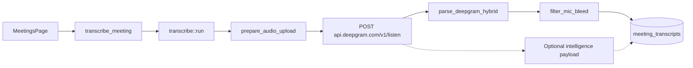

# Replace AssemblyAI with Deepgram

## Overview

Hard-replace AssemblyAI meeting transcription with Deepgram nova-3, using an **auto hybrid** speaker strategy (mic channel = You, system channel diarized into Speaker 0/1/2...). Deliver in three phases: core parity, transcription quality extras, then Deepgram Intelligence features that enrich the meeting UI.

**Decisions confirmed:**
- **Cutover:** Hard replace — remove AssemblyAI code paths entirely
- **Speaker mode:** Auto hybrid — `multichannel+diarize`, map mic = You, diarized remote speakers = Speaker N

---

## Context from testing

Prior comparison on real recordings showed:

| Meeting type | Text similarity | Notes |
|---|---|---|
| 1-on-1 calls (Shuang, Dev) | 84–90% | Multichannel works; Deepgram faster (13–58s vs async poll) |
| Multi-person (Al-Islam, 54 min) | N/A (no DB transcript) | Pure `multichannel` failed; `diarize` found 4 speakers; `multichannel+diarize` worked |

Test scripts and outputs:
- [`scripts/test-deepgram-comparison.ts`](../scripts/test-deepgram-comparison.ts)
- [`scripts/test-deepgram-multispeaker.ts`](../scripts/test-deepgram-multispeaker.ts)
- Results: [`scripts/.deepgram-comparison/`](../scripts/.deepgram-comparison/)

---

## Current architecture


### Key files today

| File | Role |
|---|---|
| [`src-tauri/src/meeting/transcribe.rs`](../src-tauri/src/meeting/transcribe.rs) | Entire AssemblyAI client (upload, submit, poll, parse) |
| [`src-tauri/src/commands.rs`](../src-tauri/src/commands.rs) | `transcribe_meeting` command (lines 244–265) |
| [`src-tauri/src/settings.rs`](../src-tauri/src/settings.rs) | `assemblyai_api_key`, keyring user `assemblyai-api-key` |
| [`src-tauri/src/db.rs`](../src-tauri/src/db.rs) | `assemblyai_transcript_id` column |
| [`src-tauri/src/meeting/types.rs`](../src-tauri/src/meeting/types.rs) | `MeetingMeta`, `MeetingTranscript`, `Utterance` |
| [`src/types.ts`](../src/types.ts) | Frontend type mirrors |
| [`src/components/Settings/MeetingsPage.tsx`](../src/components/Settings/MeetingsPage.tsx) | API key field, transcript panel, status copy |
| [`src/components/Settings/VideoPlayer.tsx`](../src/components/Settings/VideoPlayer.tsx) | Speaker turn markers on timeline |

### AssemblyAI features currently used

From `submit_transcript` in `transcribe.rs`:

```rust
struct SubmitRequest<'a> {
    audio_url: &'a str,
    speaker_labels: bool,      // true when mono (no multichannel)
    language_detection: bool,  // always true
    multichannel: bool,        // true when transcript-audio.m4a exists
}
```

Post-processing:
- Multichannel maps channel `1` → **You**, channel `2` → **System**
- `filter_multichannel_bleed` removes mic duplicates of system audio

### Existing transcript shape (unchanged)

```rust
MeetingTranscript {
    utterances: Vec<Utterance>,
    text: String,
    audio_duration_secs: Option<f64>,
    language_code: Option<String>,
    provider: String,          // "assemblyai" today → "deepgram"
    created_at_ms: i64,
}

Utterance {
    speaker: String,           // "You", "System", "A", "B", or "Speaker N"
    text: String,
    start_ms: i64,
    end_ms: i64,
    confidence: Option<f64>,
}
```

---

## Target architecture



### Deepgram request (hybrid default)

```
POST https://api.deepgram.com/v1/listen?model=nova-3&multichannel=true&diarize=true&utterances=true&punctuate=true&smart_format=true&detect_language=true&keyterm=...
Authorization: Token <deepgram_api_key>
Content-Type: audio/mp4
Body: raw audio stream (transcript-audio.m4a or FFmpeg-extracted mono)
```

### Fallback chain

Learned from Al-Islam 54-min file where pure `multichannel` returned 400:

1. **Primary:** `multichannel=true` + `diarize=true`
2. **Fallback:** on 400/corrupt — extract mono AAC, retry `diarize=true` only
3. **Error:** surface clear message if both attempts fail

### Speaker mapping (auto hybrid)

| Deepgram fields | App label |
|---|---|
| `channel == 0` | `You` |
| `channel == 1`, single speaker on remote channel | `System` (preserve 1-on-1 UX) |
| `channel == 1`, multiple diarized speakers | `Speaker 0`, `Speaker 1`, ... |
| mono + diarize only | `Speaker 0`, `Speaker 1`, ... |

**Important:** Sort all utterances by `start_ms` after parsing. Deepgram returns channel-grouped segments; the UI expects chronological interleaving.

### Bleed filter adaptation

Generalize `filter_multichannel_bleed` so **You** is compared against all non-You utterances (System + Speaker N), not only `System`.

### HTTP timeout

Dynamic: `max(300s, audio_duration_secs * 0.4)`. A 54-min file transcribed in ~60–125s during testing.

---

## Feature mapping

### Parity (Phase 1 — required)

| Current AssemblyAI | Deepgram equivalent |
|---|---|
| Upload + async poll | Single sync `POST /v1/listen` |
| `multichannel` (You/System) | `multichannel=true` |
| `speaker_labels` (mono fallback) | `diarize=true` |
| `language_detection` | `detect_language=true` |
| Utterances + timestamps + confidence | `utterances=true` |
| Retry on 429/5xx | Keep retry logic, adapt to Deepgram error bodies |

### New Deepgram features (by phase)

#### Phase 2 — transcription quality

| Feature | Param | Benefit |
|---|---|---|
| Keyterm boosting | `keyterm=term` (up to 100) | Fixes domain terms: Playwright, PMS, Shuang, OpenClaw |
| Smart formatting | `smart_format=true` | Better numbers, dates, punctuation |
| Word replacement | `replace=from:to` | Correct systematic mishearings (e.g. pay pay → Playwright) |
| Filler words | `filler_words=true` | Optional faithful transcript mode |
| Search | `search=term` | Verify if specific terms were mentioned |

Source: wire `keyterm` from enabled [`settings.vocabulary`](../src-tauri/src/settings.rs) entries.

#### Phase 3 — Intelligence layer

| Feature | Param | App enrichment |
|---|---|---|
| Summarization | `summarize=v2` | Instant short summary before user clicks Groq "Generate Summary" |
| Topic detection | `topics=true` | Auto-tag segments for meeting list search/filter |
| Sentiment analysis | `sentiment=true` | Per-segment positive/neutral/negative; highlight tense moments |
| Intent recognition | `intents=true` | Lightweight action detection ("Sync with CRM", "View chat history") |
| Entity detection | `detect_entities=true` | Names, orgs, dates as metadata chips |
| Custom topics | `custom_topic=...` | Domain-specific topic detection (e.g. "splitter", "CRM", "PMS") |

**Note:** Keep existing Groq/OpenAI markdown summary ([`summarize.rs`](../src-tauri/src/meeting/summarize.rs)) as the rich structured output. Deepgram summary is a fast preview, not a replacement.

#### Phase 4 — future (document only)

| Feature | Use case |
|---|---|
| Real-time WebSocket streaming | Live captions during recording |
| `redact` | PII redaction for sensitive client calls |
| `paragraph=true` | Readable paragraph-grouped export |
| `callback` URL | Async processing for 2+ hour files |
| `language=multi` | Multilingual code-switching (Nova-3) |
| Voice Agent / TTS APIs | Separate product features |

---

## Phase 1: Core replacement

### 1.1 Rewrite `transcribe.rs`

**Remove:**
- `ASSEMBLYAI_BASE_URL`, `/v2/upload`, `/v2/transcript`
- `upload_file`, `submit_transcript`, `poll_transcript`
- `AssemblyTranscriptResponse`, `AssemblyUtterance`
- Polling loop (`POLL_INITIAL_DELAY`, `TRANSCRIPTION_TIMEOUT` poll semantics)

**Add:**

```rust
const DEEPGRAM_LISTEN_URL: &str = "https://api.deepgram.com/v1/listen";

fn build_listen_query(settings: &AppSettings, multichannel: bool, intelligence: &IntelligenceFlags) -> String
async fn transcribe_file(client: &Client, api_key: &str, path: &Path, query: &str) -> DeepgramResponse
fn parse_deepgram_hybrid(response: DeepgramResponse) -> Result<MeetingTranscript, String>
fn map_speaker_label(channel: Option<u32>, speaker: Option<u32>, remote_speaker_count: usize) -> String
fn sort_utterances_chronologically(utterances: &mut Vec<Utterance>)
async fn transcribe_with_fallback(client: &Client, api_key: &str, upload: &AudioUpload) -> Result<DeepgramResponse, String>
```

**`parse_deepgram_hybrid` logic:**
1. Read utterances from `results.utterances` (not top-level)
2. Count distinct speakers on channel 1
3. Map each utterance to You / System / Speaker N
4. Sort by `start_ms`
5. Apply bleed filter
6. Build `text` by joining utterance texts chronologically
7. Read `detected_language` from first channel alternative
8. Set `provider: "deepgram"`

**Preserve and extend unit tests:**
- Existing bleed filter tests
- New hybrid mapping fixtures from `scripts/.deepgram-comparison/`

### 1.2 Settings and API key migration

In [`settings.rs`](../src-tauri/src/settings.rs):

| Before | After |
|---|---|
| `assemblyai_api_key: String` | `deepgram_api_key: String` |
| keyring `assemblyai-api-key` | keyring `deepgram-api-key` |
| `encrypted_assemblyai_api_key` | `encrypted_deepgram_api_key` |

Migration on load:
- `#[serde(alias = "assemblyai_api_key")]` on `deepgram_api_key` for settings.json
- If `deepgram_api_key` empty but legacy keyring entry exists, copy it over

Frontend mirrors: [`constants.ts`](../src/constants.ts), [`types.ts`](../src/types.ts).

### 1.3 Database migration

In [`db.rs`](../src-tauri/src/db.rs) using existing `ensure_*_columns` pattern:

```sql
ALTER TABLE meetings ADD COLUMN deepgram_request_id TEXT;
-- Copy assemblyai_transcript_id → deepgram_request_id for existing rows
-- Stop writing assemblyai_transcript_id
```

Update [`MeetingMeta`](../src-tauri/src/meeting/types.rs):
```rust
#[serde(alias = "assemblyai_transcript_id")]
pub deepgram_request_id: Option<String>,
```

Existing `meeting_transcripts` JSON with `provider: "assemblyai"` remains readable as historical data.

### 1.4 Command and manager wiring

[`commands.rs`](../src-tauri/src/commands.rs):
```rust
let api_key = settings.deepgram_api_key.trim().to_string();
if api_key.is_empty() {
    return Err("Add your Deepgram API key in Meeting settings.".to_string());
}
```

Update: [`meeting/manager.rs`](../src-tauri/src/meeting/manager.rs), [`meeting/storage.rs`](../src-tauri/src/meeting/storage.rs).

### 1.5 UI updates

[`MeetingsPage.tsx`](../src/components/Settings/MeetingsPage.tsx):
- Transcription tab: "Deepgram API key" input + updated help text
- Remove all "AssemblyAI" user-facing strings
- Transcribing state: "Deepgram is processing..." (no upload/poll language)

[`VideoPlayer.tsx`](../src/components/Settings/VideoPlayer.tsx):
- Extend speaker color palette for `Speaker 0/1/2/3` (currently only You gets primary color)

[`README.md`](../README.md): update meeting transcription section.

---

## Phase 2: Transcription quality

### 2.1 Vocabulary → keyterm boosting

```rust
fn vocabulary_keyterms(settings: &AppSettings) -> Vec<String> {
    settings.vocabulary.iter()
        .filter(|e| e.enabled)
        .map(|e| e.term.clone())
        .take(100)
        .collect()
}
```

Append to query: `&keyterm=Playwright&keyterm=PMS&keyterm=Shuang&...`

### 2.2 Word replacement map

Option A: reuse vocabulary `replacement` field → `replace=misheard:correct`
Option B: new `meeting_word_replacements` setting

### 2.3 Orphan meeting import

Al-Islam meeting (`75da723d-1496-493b-862c-292148c249ab`) exists on disk (54 min, 38MB audio) but not in SQLite.

Add startup scan in [`storage.rs`](../src-tauri/src/meeting/storage.rs):
- For each folder in `meetings/{uuid}/` with `recording.mp4` but no DB row → import as `status: recorded`

---

## Phase 3: Intelligence enrichment

### 3.1 Extend transcript model

```rust
#[derive(Debug, Clone, Serialize, Deserialize)]
pub struct MeetingTranscript {
    // ... existing fields ...
    #[serde(default, skip_serializing_if = "Option::is_none")]
    pub intelligence: Option<MeetingIntelligence>,
}

#[derive(Debug, Clone, Serialize, Deserialize)]
pub struct MeetingIntelligence {
    pub summary_short: Option<String>,
    pub topics: Vec<TopicHit>,
    pub sentiments: Vec<SentimentSegment>,
    pub intents: Vec<IntentHit>,
    pub entities: Vec<EntityHit>,
}
```

### 3.2 Settings toggles

Add to `AppSettings` / Meetings > Transcription tab:

| Setting | Default | Deepgram param |
|---|---|---|
| `meeting_deepgram_summary` | `true` | `summarize=v2` |
| `meeting_deepgram_topics` | `false` | `topics=true` |
| `meeting_deepgram_sentiment` | `false` | `sentiment=true` |
| `meeting_deepgram_intents` | `false` | `intents=true` |
| `meeting_deepgram_entities` | `false` | `detect_entities=true` |

### 3.3 UI enrichment

| Feature | UI placement |
|---|---|
| Short summary | Card above transcript tab (instant, before "Generate Summary") |
| Topics | Chips under meeting title; filter in meeting list |
| Sentiment | Color dot or left border on utterance rows |
| Entities | Metadata sidebar: people, orgs mentioned |
| Speaker rename | Let user rename `Speaker 1` → `Anna`; persist in transcript or meeting metadata |

### 3.4 Sample intelligence output (from Shuang 19-min test)

**Summary:** "Speakers discuss CRM for patient records, PMS integration, data onboarding via Chromium scraping, human-agent handoff cron jobs, WhatsApp name syncing..."

**Topics detected:** Data onboarding (0.91), Legacy software (0.93), Workflow (0.92), PMS (0.68)

**Sentiment:** Rate-limiting concerns flagged negative (-0.45); integration possibilities positive (+0.48)

---

## Testing plan

| Layer | What to test |
|---|---|
| Rust unit | `parse_deepgram_hybrid`, speaker mapping, bleed filter with Speaker N, query builder, keyterm injection |
| Rust integration | Mock Deepgram HTTP (hybrid success, 400 → mono fallback, retries) |
| Manual | Re-run comparison script on all 6 DB meetings + Al-Islam orphan |
| Regression | AssemblyAI transcripts still render; new ones use `provider: "deepgram"` |
| Multi-speaker | Al-Islam 54-min: 3–4 distinct speakers, chronological utterances, video seek |

---

## Risks and mitigations

| Risk | Mitigation |
|---|---|
| `multichannel` alone fails on some m4a files | Auto fallback to `diarize` on mono extract |
| Long meetings exceed HTTP timeout | Dynamic timeout from `metadata.duration` |
| More speakers → noisy timeline | VideoPlayer collapses to speaker turns; optional merge threshold |
| Intelligence adds cost/latency | Per-feature toggles in settings |
| Key migration breaks users | `serde(alias)` + keyring copy on first launch |
| Groq summary references You/System | Summary prompt in `summarize.rs` already handles generic speaker labels — extend for Speaker N |

---

## PR stack (5 PRs)

| PR | Scope | Ships independently? |
|---|---|---|
| **1. deepgram-core** | Rewrite `transcribe.rs`, settings/keyring, command wiring, unit tests | Yes (minimum viable) |
| **2. deepgram-schema** | DB column migration, type renames, orphan meeting import | Yes |
| **3. deepgram-ui** | MeetingsPage, VideoPlayer colors, README | Yes — completes hard replacement |
| **4. deepgram-keyterms** | Vocabulary → keyterm + replace map | Yes |
| **5. deepgram-intelligence** | Extended transcript model, settings toggles, UI enrichment | Yes |

PRs 1–3 complete the hard AssemblyAI → Deepgram cutover. PRs 4–5 add Deepgram-exclusive value.

---

## Implementation checklist

- [ ] Rewrite `src-tauri/src/meeting/transcribe.rs` (Deepgram client, hybrid parse, fallback, tests)
- [ ] Rename `assemblyai_api_key` → `deepgram_api_key` (settings, keyring, TS types, serde alias)
- [ ] DB: add `deepgram_request_id`, migrate old column, update queries
- [ ] Update `MeetingsPage.tsx`, `VideoPlayer.tsx`, `README.md`
- [ ] Wire vocabulary → `keyterm` query params
- [ ] Import orphan meeting folders into SQLite
- [ ] Extend `MeetingTranscript` with `MeetingIntelligence`
- [ ] Add intelligence settings toggles + UI (summary card, topic chips, sentiment indicators)
- [ ] Optional: speaker rename UI for hybrid calls